Manual de usuario de Gestor Académico
=====================================

Introducción
------------

En este manual de usuario constará de dos partes fundamentales, que harán referencia a los dos roles contemplados en esta versión de la aplicación. Estos roles o nivel de usuario son: *Docente* y *Técnico de calidad*.

Esta diferencia es necesaria en el manual, ya que cada uno de los perfiles tiene restringido el acceso a parte de la información.

Pantalla de inicio
------------------

La pantalla de inicio de la aplicación es común para todos los usuarios.

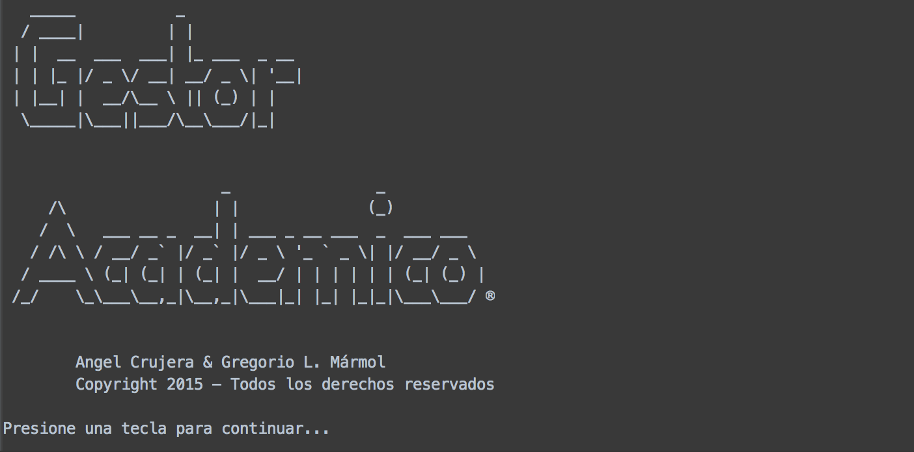

Para avanzar a la siguiente pantalla hay tenemos que pulsar cualquier tecla, y nos aparecerá una pantalla para introducir nuestras credenciales, usuario y contraseña. A continuación mostraremos el usuario y la contraseña de un usuario de cada uno de los roles para poder hacer pruebas.

Credenciales de docente para el ejemplo:

Usuario: **u49251223B**

Password: **docente1**

Técnico de calidad:

Usuario: **u10025580R**

Password: **tecnico**

Rol: Docente
------------

En este apartado se explicaran las diferentes opciones a la que se le permite acceder a un usuario con el rol de docente.
El menú que nos aparecerá si nos logueamos con un perfil de este tipo es el siguiente:

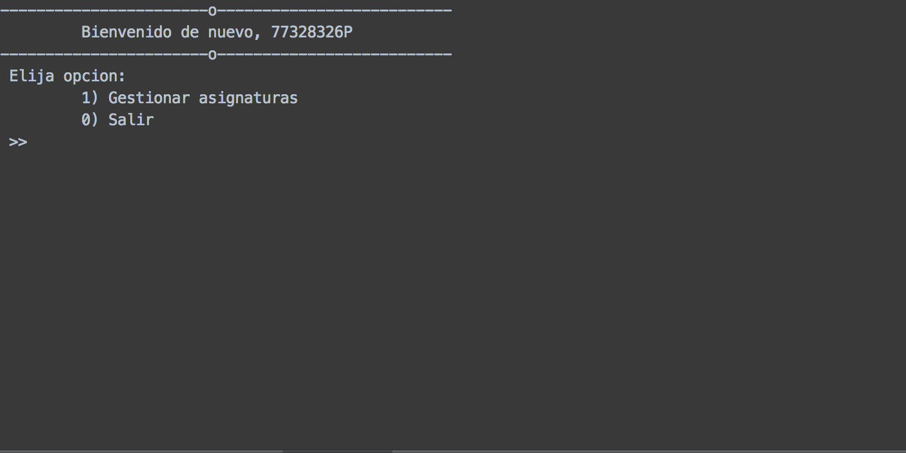

En el podemos ver dos opciones después de un mensaje de bienvenida, la primera que nos permite hacer algunas gestiones sobre asignaturas que imparta el usuario con el que nos hayamos registrado, y la segunda que cierra la aplicación. Para elegir una de las dos introducimos el número correspondiente.

La imagen a continuación mostrada es la correspondiente a pulsar 1 en el menú anterior y la tecla *Enter*, donde se mostraran las asignaturas a la que el usuario tiene acceso:

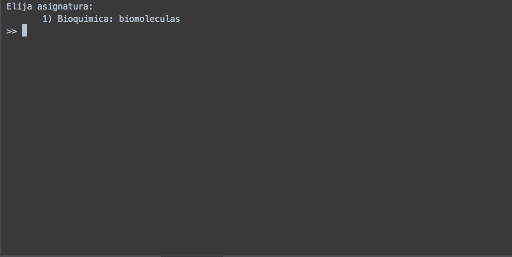

En este caso el usuario con el que nos hemos logueado solo tiene acceso a una asignatura, para seleccionarla volvemos a introducir el número que le corresponde en el menú. Una vez seleccionada, pulsamos *Enter* y nos aparece la siguiente pantalla:

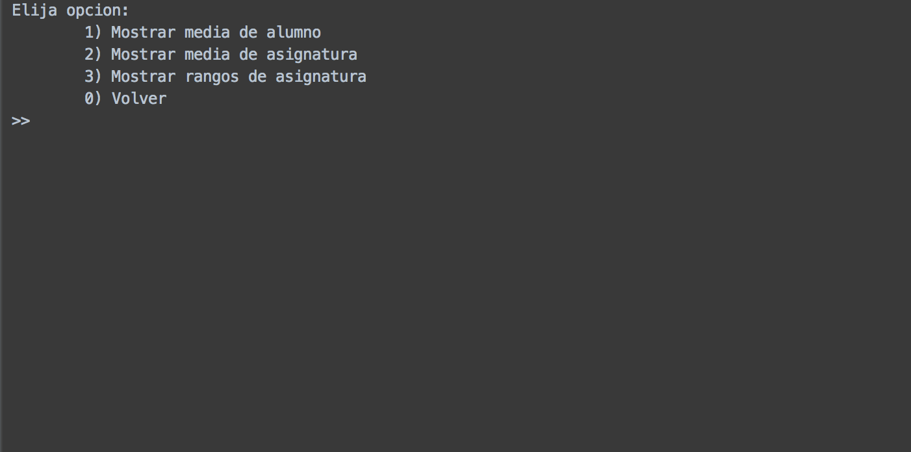

Nos aparecen las siguientes opciones:

1 - Mostrar media de alumno: esta opción nos permite seleccionar a un alumno de la asignatura y ver su nota media en ésta.

2 - Mostrar media de asignatura: esta opción nos muestra la nota media de todos los alumnos matriculados en la asignatura.

3 - Mostrar rangos de asignatura: esta opción nos clasifica las notas de los alumnos en los rangos de notas ya conocidos
(suspenso, aprobado, notable y sobresaliente) y nos muestra el número de notas que se encuentra en cada rango.

0 - Volver: vuelve a la pantalla de selección de asignatura.

A continuación, se mostrará para cada opción las pantallas que se mostrarán. Empecemos por la opción 1, la siguiente pantalla que visualizaremos es:

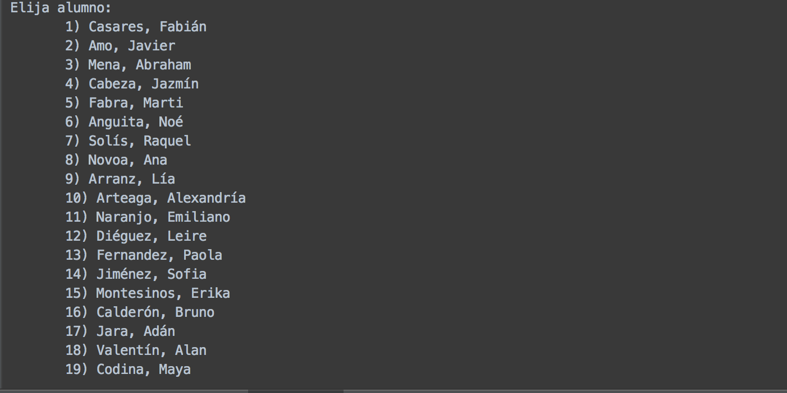
.. image:: _static/images/Docente/3-1-2-1-2.png

En la imagen podemos ver que nos aparecen nombres listados, éstos son los nombres de los alumnos matriculados o que están cursando esa asignatura. Para seleccionar el alumno del que queremos obtener su nota media, introducimos el número que tiene asociado y pulsamos *Enter*, en el ejemplo seleccionaremos a la alumna 8 *Ana Novoa*. La nota media se presentará de esta forma:

.. image:: _static/images/Docente/3-1-2-1-3.png

Cuando pulsemos una tecla, retrocederemos hasta el menú de gestión de la asignatura.

Si seleccionamos la segunda opción nos aparecerá una pantalla con la nota media de la asignatura, como la siguiente:

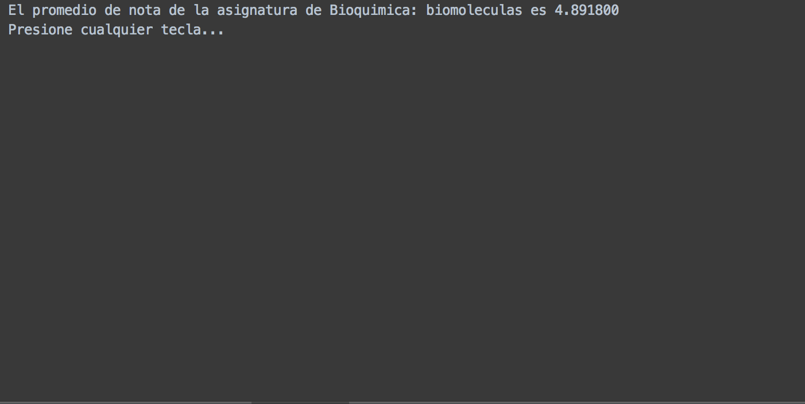

Cuando presionemos cualquier tecla volveremos al menú. Por último si seleccionamos la tercera opción, nos aparecerán las notas de los alumnos de la asignatura clasificadas de las siguiente forma:

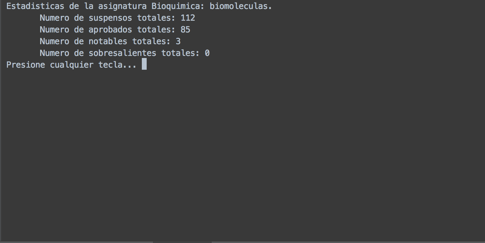

Rol: Técnico de calidad
-----------------------

En este apartado se explicaran las diferentes opciones a la que se le permite acceder a un usuario con el rol de técnico de calidad.
La pantalla que nos aparecerá si nos logueamos con un perfil de este tipo es la siguiente:

.. image:: _static/images/Tecnico/3-.png

Podemos ver que después del mensaje de bienvenida, el sistema nos muestra dos tipos de medias que nos hacen tener un visión del estado del centro en cada momento. La primera es una nota promedio por alumno, y la segunda es por asignaturas.
Éstas se actualizan automáticamente cada vez que llegamos a esa pantalla. Debajo de estas estadísticas, nos aparecerá el siguiente menú:
1 - Gestionar alumnos: esta opción nos permite ver datos estadísticos sobre un alumno concreto del centro.
2 - Gestionar asignaturas: esta opción nos permite ver datos estadísticos sobre una asignatura impartida en el centro.
3 - Gestionar grados: esta opción nos permite ver datos estadísticos sobre los grados/cursos del centro.
0 - Salir: esta opción sale de la aplicación.

Vamos a comenzar viendo el contenido de *Gestionar alumnos*, para ello pulsamos *1* y le damos a *Enter*. Nos aparecerá la lista de todos los alumnos del centro:

.. image:: _static/images/Tecnico/3-1-1.png
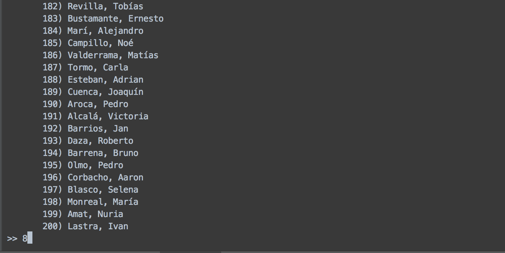

Seleccionamos al alumno del que queramos obtener información, para ello tenemos que introducir el número con el que aparece y pulsar *Enter*. Nosotros hemos introducido el número *8* correspondiente con la alumna *Ana Novoa*.
Una vez pulsado *Enter*, nos aparecerá el siguiente menú, en el que la forma de seleccionar una opción será igual que en los menús anteriores:

.. image:: _static/images/Tecnico/3-1-3-.png

1 - Mostrar media de alumno: nos presentará la media general del alumno.

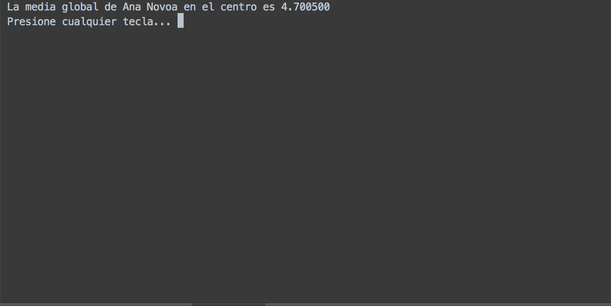

2 - Mostrar rangos de alumno: nos clasificará todas las notas del alumno en los rangos estándar de notas (suspenso, aprobado, notable y sobresaliente).

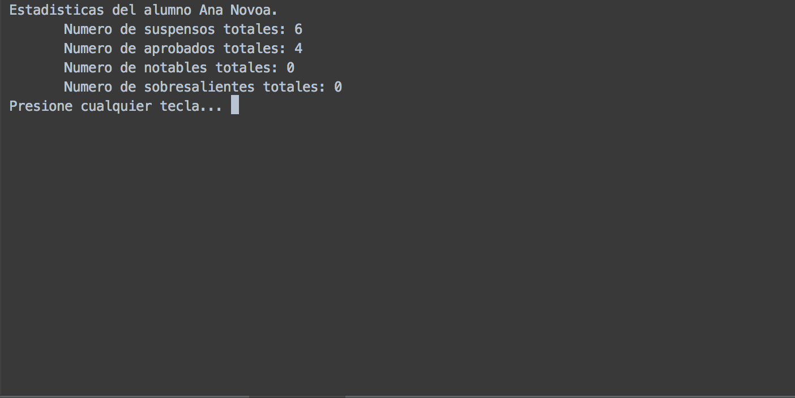

Para salir de las dos pantallas anteriores tenemos que pulsar cualquier tecla, como podemos observar en las imágenes.

0 - Volver: retorna a la pantalla anterior.

Ahora vamos a mostrar el submenú que aparece cuando elegimos la opción 2 *Gestionar asignaturas*:

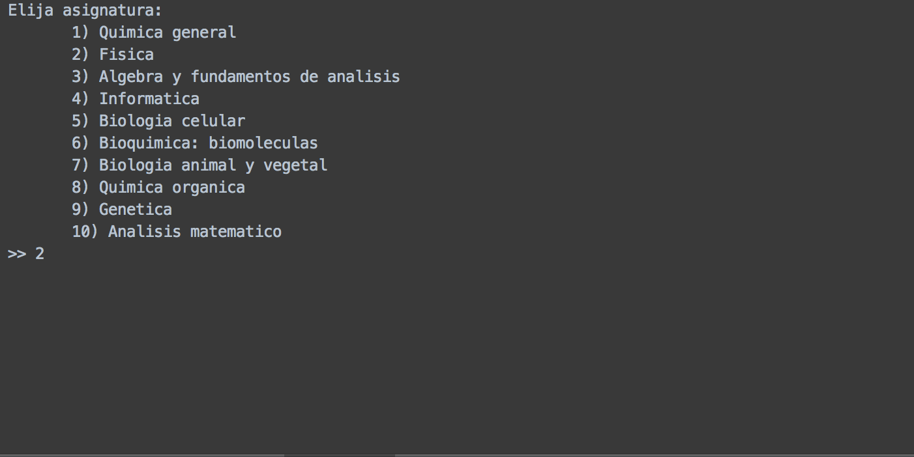

Como podemos observar lo primero que tenemos que hacer es seleccionar la asignatura de la que queremos hacer el análisis estadístico. En este ejemplo seleccionaremos la asignatura de *Fisica*.

.. image:: _static/images/Tecnico/3-2-2-.png

Nos aparecerán las opciones que podemos ver en la imagen anterior. Vamos a ver que pasos tenemos que dar si seleccionamos la primera opción, que nos permite ver la media de un alumno en la asignatura que hemos seleccionado anteriormente, en nuestro caso *Fisica*:

.. image:: _static/images/Tecnico/3-2-2-1-2.png

Se nos presenta la lista de los alumnos que están matriculados en la asignatura. Seleccionamos a uno de ellos, en el ejemplo volvemos a seleccionar a *Ana Novoa*, y nos aparecerá su media en la asignatura:

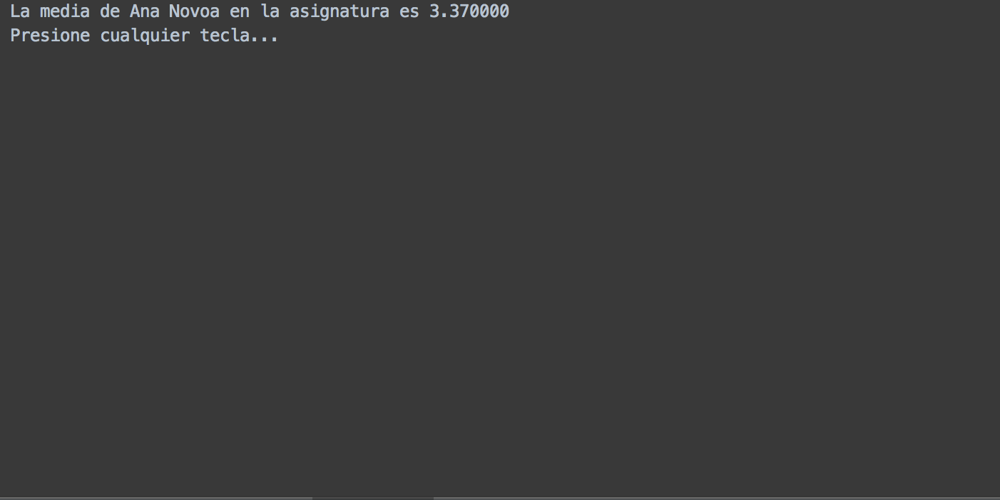

Si seleccionamos, en el menú de gestión de asignaturas, la opción 2 *Mostrar media de la asignatura*, nos llevará a la siguiente pantalla donde se nos mostrará la nota media de la asignatura, en el ejemplo recordamos que estamos con *Fisica*:

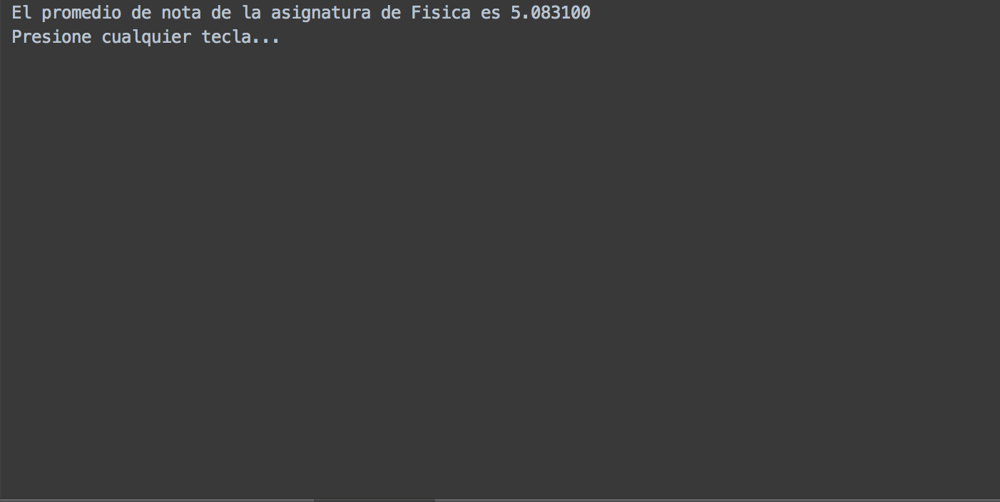

Si lo que queremos son las notas clasificadas por rangos, elegimos la opción 3 *Mostrar rangos de asignatura*, y nos aparecerá una pantalla tal que:

.. image:: _static/images/Tecnico/3-2-2-3.png

Por último nos queda la opción del menú principal de *Gestionar grados*, para acceder a ella en el menú principal de técnico pulsamos 3 y *Enter*.

Nos aparecerá una pantalla en la que tenemos que elegir el grado del que queremos obtener datos estadísticos.

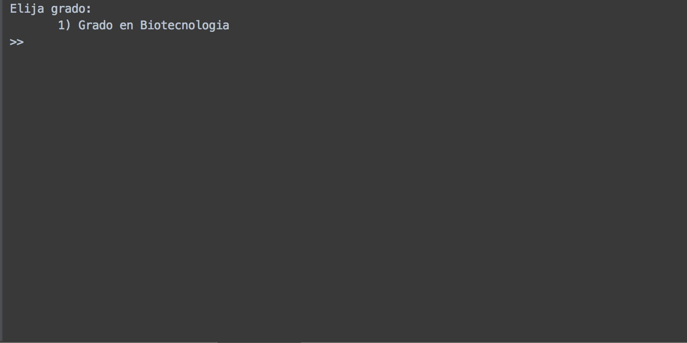

En el ejemplo seleccionaremos el único grado que hay. A continuación nos aparece el siguiente menú:

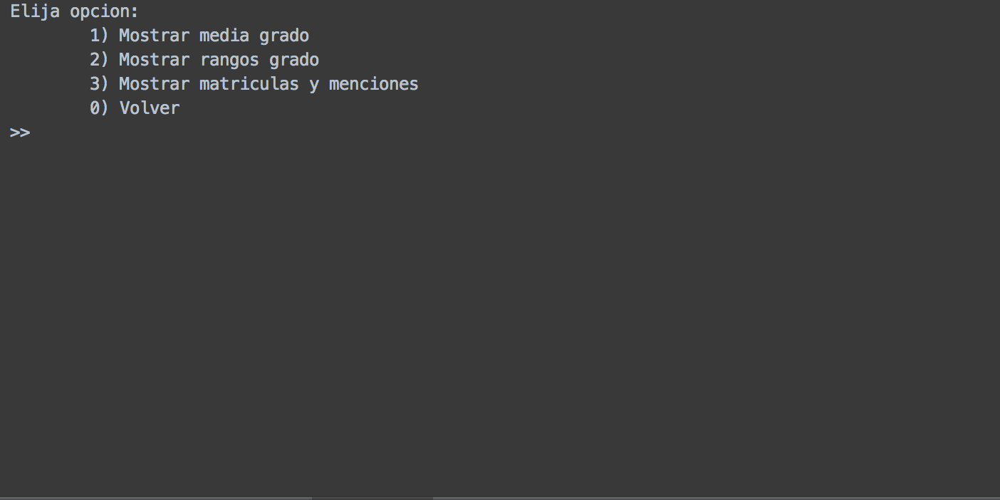

1 - Mostrar media grado: nos dará la media global del grado:

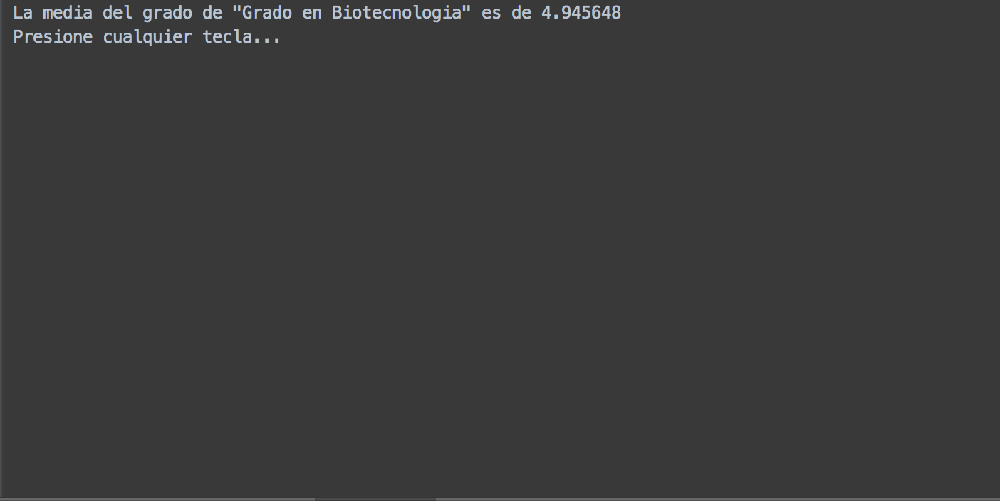

2 - Mostrar rangos grado: nos dirá la cantidad de suspensos, aprobados, notables y sobresalientes hay actualmente en el grado:

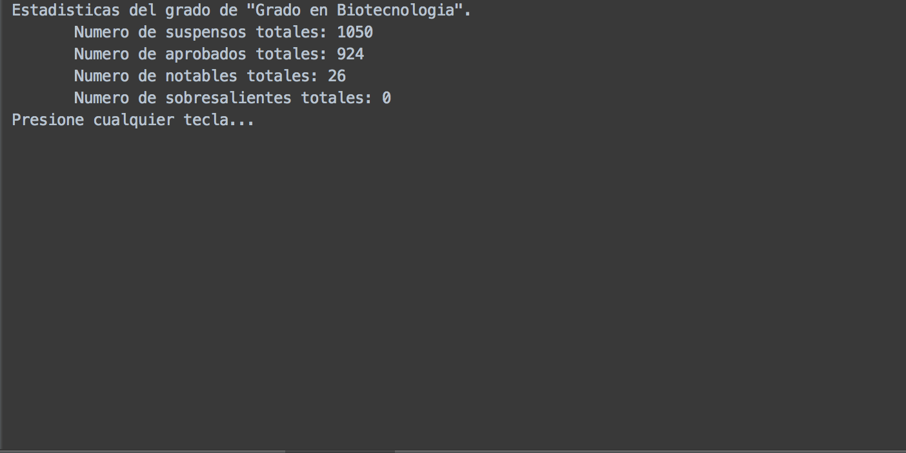

3 - Mostrar matrículas y menciones: nos mostrará el número de matrículas y menciones que hay en el grado:

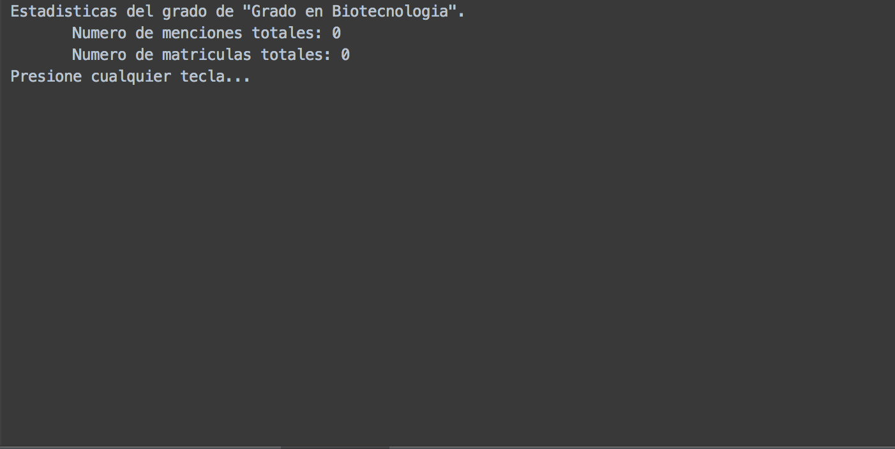

